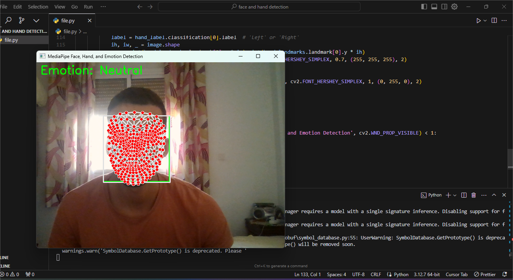

# Face, Hand, and Emotion Tracker

## Overview

The Face, Hand, and Emotion Tracker is a Python project that uses OpenCV and MediaPipe to detect faces, hands, and estimate emotions from live webcam input. This project provides a real-time interface to display detected facial landmarks, count fingers, and classify emotions based on facial expressions.

<div>
    
    
</div>

## Features

- Real-time face detection using MediaPipe.
- Detection of facial landmarks (mesh).
- Hand tracking and counting of fingers.
- Emotion estimation based on facial expressions.
- Live video feed from the webcam.

## Requirements

- Python 3.x
- OpenCV
- MediaPipe
- NumPy
- SciPy

## Installation

1. Clone the repository:

   ```bash
   git clone https://github.com/youssefhajaj/FaceHandEmotionTracker.git
   cd FaceHandEmotionTracker

2. Install the required packages:
   ```bash
   pip install opencv-python mediapipe numpy scipy

3. Usage:
- Ensure your webcam is working and accessible.
- Run the main Python script:
   ```bash
   python file.py

